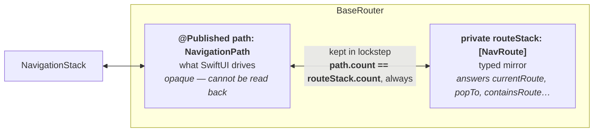
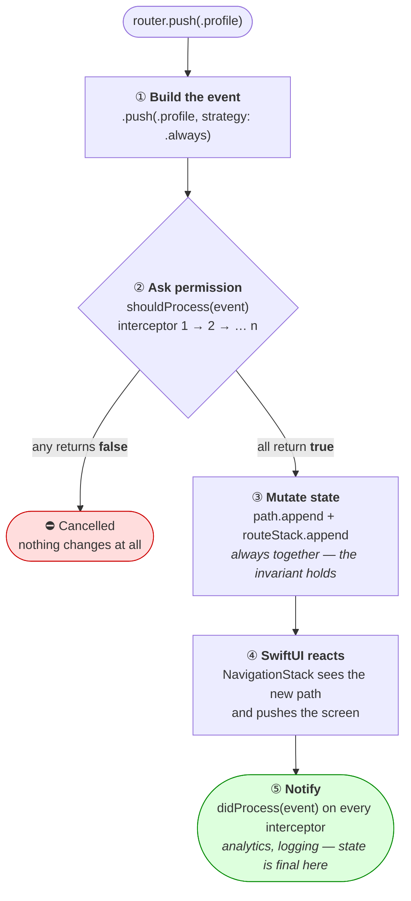
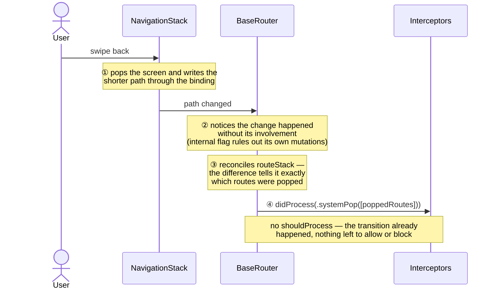

# 🧭 NaviStack


A type-safe, interceptable navigation system for SwiftUI. Centralized stack management, global sheet/cover handling, deep-link-ready APIs, and a two-phase interceptor pipeline for auth guards, analytics, and navigation locks.

🇻🇳 [Đọc bản tiếng Việt](README.vi.md)

## 📋 Table of Contents

- [Why NaviStack?](#-why-navistack)
- [Features](#-features)
- [Architecture & How It Works](#-architecture--how-it-works)
- [Requirements](#-requirements)
- [Installation](#-installation)
- [Quick Start](#-quick-start)
- [The Golden Rule](#-the-golden-rule)
- [Navigation API](#-navigation-api)
- [Sheets & Full-Screen Covers](#-sheets--full-screen-covers)
- [Interceptors](#-interceptors)
- [Production Use Cases](#-production-use-cases)
- [Limitations & Gotchas](#-limitations--gotchas)
- [Properties Reference](#-properties-reference)
- [Testing](#-testing)
- [FAQ](#-faq)
- [License](#-license)

---

## 🎯 Why NaviStack?

Traditional SwiftUI navigation often leads to:

- Multiple `@State` variables per screen
- Navigation logic scattered across views
- Hard-to-test flows
- No type safety, no navigation history

**NaviStack** centralizes navigation with:

- One object that owns all navigation state per `NavigationStack`
- Type-safe route enums
- Built-in sheet & fullScreenCover handling
- Interceptor hooks for guards, analytics, locks
- One-step deep linking (`setStack`) and state restoration

---

## ✨ Features

- ✅ **Swift 6 native** — strict concurrency, `@MainActor` router & interceptors
- ✅ **Type-safe navigation** — enum-based routes
- ✅ **Push strategies** — `.always`, `.ifNotExists`, `.navigateOrPush`
- ✅ **One-step deep linking** — `setStack(_:)` replaces the whole stack in a single transition
- ✅ **`dismissAll()`** — close every modal and pop to root in one call
- ✅ **System back detection** — back swipes are reported to interceptors as `.systemPop`
- ✅ **Two-phase interceptors** — block before, observe after; removable by token
- ✅ **State restoration** — `encodedStack()` / `restoreStack(from:)` when routes are `Codable`
- ✅ **Structured logging** — `os.Logger` (subsystem `com.navistack`), filterable in Console.app

---

## 🏗 Architecture & How It Works

This section explains every moving part so that any developer can understand the package in one read.

### The package at a glance

The package has exactly **three source files** and **five public types**:

```
NaviStack
├── BaseRouter.swift        →  BaseRouter            (the router itself)
├── Interceptor.swift       →  Interceptor protocol, InterceptorToken
└── InterceptorEvent.swift  →  NavigationEvent, SheetEvent, CoverEvent (+ PushStrategy)
```

| Component | What it is | What it does |
|---|---|---|
| `BaseRouter<NavRoute, SheetRoute, CoverRoute>` | `@MainActor` class, `ObservableObject` | Owns all navigation state. Exposes the navigation API (`push`, `pop`, `setStack`, `presentSheet`, …). Runs every action through the interceptor pipeline. |
| `NavRoute` / `SheetRoute` / `CoverRoute` | Generic parameters | **Your** enums describing the app's screens: pushed screens, sheets, and full-screen covers. Use `Never` for slots you don't need. |
| `Interceptor` | `@MainActor` protocol | The extension point. Gets asked *before* every action (can block) and notified *after* (for side effects). |
| `NavigationEvent` / `SheetEvent` / `CoverEvent` | Enums (`Equatable`) | Describe *what is happening*: `.push(.profile, …)`, `.systemPop([…])`, `.present(.login)`, … Passed to interceptors and easy to assert in tests. |
| `InterceptorToken` | Opaque struct | Receipt returned by `addInterceptor`. Lets you remove exactly that interceptor later. |

### The state model — why the router keeps *two* containers

Internally, `BaseRouter` holds the navigation stack twice, and this is the key design decision to understand:



- **`path`** is SwiftUI's `NavigationPath` — the only thing `NavigationStack` understands. It is *write-only*: you can append and remove, but you can never ask "what is the route at position 2?"
- **`routeStack`** is a plain `[NavRoute]` array the router maintains in lockstep with `path`. It exists *because* `path` is opaque — without it, `currentRoute`, `navigationDepth`, and `popTo(_:)` would be impossible to implement.

Every mutation updates **both containers together**. When the *system* changes `path` (back swipe), the router reconciles `routeStack` immediately (see flow ② below). This is also why the [Golden Rule](#-the-golden-rule) exists: a `NavigationLink(value:)` writes into `path` only, and the router has no way to know *what* was pushed.

### Flow ① — life of a programmatic navigation (`push`, `pop`, `setStack`, …)



The same five steps apply to every programmatic API: `pop`, `popTo`, `popToRoot`, `replace`, `setStack`, `presentSheet`, `dismissSheet`, and the cover equivalents. Only the event type differs.

### Flow ② — life of a system back (swipe gesture, back button)

The user can leave a screen without ever calling the router: edge swipe, the navigation bar back button, or the long-press back menu. The router *observes* these instead of driving them:



This is why analytics interceptors see **every** exit, including gesture-driven ones — and why `.systemPop` can never be blocked.

### Flow ③ — sheets & covers

Sheets have two dismissal paths, and they behave differently on purpose:

| | Programmatic (`router.dismissSheet()`) | Gesture (drag down) |
|---|---|---|
| Can interceptors block it? | ✅ yes, via `shouldProcess` | ❌ no — the sheet is already gone from screen |
| Event delivered | `.dismiss(programmatic: true)` | `.dismiss(programmatic: false)`, `didProcess` only |
| How to prevent it | return `false` from an interceptor | `.interactiveDismissDisabled()` on the sheet content |

The router exposes `sheetBinding` / `fullScreenCoverBinding` — ready-made `Binding`s for `.sheet(item:)` / `.fullScreenCover(item:)`. The binding's setter is how the router *detects* gesture dismissals: SwiftUI writes `nil` into it when the drag completes.

### Design principles

1. **One source of command.** All navigation goes through the router; the router is the only writer of `path` (the Golden Rule).
2. **You cannot block the past.** Events the system already performed (`.systemPop`, gesture dismiss) are *reported*, never *asked* — pretending otherwise would desync state from what's on screen.
3. **Atomic mutations.** `setStack` changes the whole stack in one write — one animation, one event, no half-built states.
4. **Fail loud in development.** If `path` grows behind the router's back, a `fault`-level log fires immediately instead of letting `currentRoute` rot silently.
5. **Fully synchronous & testable.** Every API call completes synchronously; events are `Equatable`; no UI tests needed for navigation logic.

---

## 📦 Requirements

- iOS 16.0+ / macOS 13.0+
- Swift 6.0 toolchain (Xcode 16+)

> The package compiles in Swift 6 language mode. Apps consuming it can be in Swift 5 or Swift 6 mode — the `@MainActor` interceptor protocol works in both.

---

## 🚀 Installation

### Swift Package Manager

```swift
dependencies: [
    .package(url: "https://github.com/konotori/NaviStack.git", from: "1.0.0")
]
```

### Manual Installation

Add the source files: `BaseRouter.swift`, `Interceptor.swift`, `InterceptorEvent.swift`.

---

## ⚡ Quick Start

### Step 1: Define Routes

```swift
import NaviStack

// Pushed screens — Hashable required, Codable only if you want state restoration
enum AppRoute: Hashable, Codable {
    case home
    case profile(userId: String)
    case editProfile(userId: String)
    case settings
    case orders
    case orderDetail(id: String)
}

// Sheets — Identifiable required.
// For enums with associated values, `var id: Self { self }` + Hashable is the simplest way.
enum AppSheet: Identifiable, Hashable {
    case userInfo(id: String)
    case createPost

    var id: Self { self }
}

// Full-screen covers
enum AppCover: Identifiable, Hashable {
    case login
    case onboarding

    var id: Self { self }
}
```

### Step 2: Create Your Router

```swift
typealias AppBaseRouter = BaseRouter<AppRoute, AppSheet, AppCover>

final class AppRouter: AppBaseRouter {}
```

> The `AppBaseRouter` typealias keeps interceptor signatures short — you'll use it a lot.

### Step 3: Wire Up `NavigationStack`

```swift
struct ContentView: View {
    @StateObject private var router = AppRouter()

    var body: some View {
        NavigationStack(path: $router.path) {
            HomeView()
                .navigationDestination(for: AppRoute.self) { route in
                    switch route {
                    case .home:
                        HomeView()
                    case .profile(let id):
                        ProfileView(userId: id)
                    case .editProfile(let id):
                        EditProfileView(userId: id)
                    case .settings:
                        SettingsView()
                    case .orders:
                        OrdersView()
                    case .orderDetail(let id):
                        OrderDetailView(orderId: id)
                    }
                }
        }
        .sheet(item: router.sheetBinding) { sheet in
            switch sheet {
            case .userInfo(let id):
                UserInfoView(userId: id)
            case .createPost:
                CreatePostView()
            }
        }
        .fullScreenCover(item: router.fullScreenCoverBinding) { cover in
            switch cover {
            case .login:
                LoginView()
            case .onboarding:
                OnboardingView()
            }
        }
        .environmentObject(router)
    }
}
```

> ⚠️ Note: pass `router.sheetBinding` (not `$router.sheetBinding`) — it is already a `Binding`.

### Step 4: Navigate!

```swift
struct HomeView: View {
    @EnvironmentObject var router: AppRouter

    var body: some View {
        VStack(spacing: 20) {
            Button("View Profile") {
                router.push(.profile(userId: "123"))
            }
            Button("Show User Info Sheet") {
                router.presentSheet(.userInfo(id: "456"))
            }
            Button("Back") {
                router.pop()
            }
            Button("Back to Root") {
                router.popToRoot()
            }
        }
        .navigationTitle("Home")
    }
}
```

---

## 📐 The Golden Rule

> **Every navigation must go through the router.**

Do **not** use `NavigationLink(value:)`:

```swift
// ❌ WRONG — bypasses the router
NavigationLink(value: AppRoute.settings) {
    Text("Settings")
}

// ✅ RIGHT — goes through the router
Button("Settings") {
    router.push(.settings)
}
```

**Why:** `NavigationPath` is opaque — the router cannot read what's inside it. When `NavigationLink(value:)` grows the path behind the router's back, `currentRoute`, `navigationDepth`, and `popTo` become silently wrong, and the desync persists until you return to root. (See [the state model](#the-state-model--why-the-router-keeps-two-containers) for the full explanation.)

The router detects this at runtime and logs a **fault** (visible in Console.app under subsystem `com.navistack`):

```
NavigationPath grew outside the router (path: 3, tracked: 2).
Did you use NavigationLink(value:)? ...
```

If you see this log, find and replace the offending `NavigationLink(value:)`.

System-driven *removals* (back swipe, back button) are fully supported — see [System back & `.systemPop`](#system-back--systempop).

---

## 🧭 Navigation API

### Push Strategies

```swift
// Always push (duplicates allowed) — default
router.push(.profile(userId: "123"))

// Push only if the route isn't already in the stack
router.push(.profile(userId: "123"), strategy: .ifNotExists)

// Jump back to the route if it exists, push otherwise
router.push(.profile(userId: "123"), strategy: .navigateOrPush)
```

| Strategy | Behavior | Typical use |
|---|---|---|
| `.always` | Pushes unconditionally | General navigation |
| `.ifNotExists` | No-op when route already in stack | Preventing duplicate screens |
| `.navigateOrPush` | Pops back to existing route, or pushes | Tab re-tap, "go to X" buttons |

### Pop Operations

```swift
router.pop()              // one screen back
router.popTo(.orders)     // back to the NEAREST occurrence of .orders
router.popToRoot()        // clear the stack
```

> **Duplicate routes:** when the same route appears multiple times in the stack
> (e.g. `profile(A) → followers → profile(B) → … → profile(A)` flows in social apps),
> `popTo` and `.navigateOrPush` target the **nearest** (most recent) occurrence — the
> one the user saw last — not the oldest one.

### Replace & Set Stack

```swift
// Swap the top screen (e.g. skeleton → loaded content)
router.replace(with: .orderDetail(id: "42"))

// Replace the WHOLE stack in one step — one transition, one interceptor event
router.setStack([.orders, .orderDetail(id: "42")])
```

`setStack(_:)` is the deep-link workhorse. Compared to `popToRoot()` + N × `push()`:

- SwiftUI performs **one** animated transition instead of N+1 (no flicker, no dropped pushes)
- Interceptors see **one** `.setStack(routes)` event — an auth guard either allows the whole destination or blocks it; no half-built stacks

### Dismiss Everything

```swift
router.dismissAll()   // dismiss cover → dismiss sheet → popToRoot
```

Call this before handling a deep link — if a sheet is open when a push notification arrives, the destination would otherwise be built *behind* the sheet.

---

## 📄 Sheets & Full-Screen Covers

```swift
router.presentSheet(.createPost)
router.dismissSheet()

router.presentFullScreenCover(.login)
router.dismissFullScreenCover()

// Read-only state
let sheet = router.presentedSheet            // AppSheet?
let cover = router.presentedFullScreenCover  // AppCover?
```

### Interactive dismiss (drag-to-dismiss)

When the user **drags a sheet down**, the dismissal has *already happened* by the time the router observes it — it cannot be blocked. The router syncs its state and notifies interceptors with `SheetEvent.dismiss(programmatic: false)` via `didProcess` only.

**To prevent drag-to-dismiss, use SwiftUI's mechanism** (which acts *before* the gesture):

```swift
.sheet(item: router.sheetBinding) { sheet in
    CreatePostView()
        .interactiveDismissDisabled(hasUnsavedChanges)
}
```

Programmatic dismissal (`router.dismissSheet()`) **does** go through `shouldProcess` and can be blocked. The event payload tells you which it was: `.dismiss(programmatic: true/false)`.

### One sheet at a time

The router manages **one global sheet and one cover**. Presenting a new sheet while one is visible *replaces* its content rather than stacking. For sheet-over-sheet flows, give the sheet its own `NavigationStack` and child router — see [Use Case 6](#6-complex-flow-inside-a-sheet--child-router).

---

## 🎯 Interceptors

Interceptors are the extension point for cross-cutting navigation concerns: auth guards, analytics, logging, feature flags, navigation locks.

### The Protocol

```swift
@MainActor
public protocol Interceptor<NavRoute, SheetRoute, CoverRoute> {
    associatedtype NavRoute: Hashable
    associatedtype SheetRoute: Identifiable
    associatedtype CoverRoute: Identifiable

    // Called BEFORE the action — return false to block. (Blockable events only.)
    func shouldProcess(_ event: NavigationEvent<NavRoute>, for router: BaseRouter<...>) -> Bool
    func shouldProcess(_ event: SheetEvent<SheetRoute>, for router: BaseRouter<...>) -> Bool
    func shouldProcess(_ event: CoverEvent<CoverRoute>, for router: BaseRouter<...>) -> Bool

    // Called AFTER the action succeeded — side effects (analytics, logging).
    func didProcess(_ event: NavigationEvent<NavRoute>, for router: BaseRouter<...>)
    func didProcess(_ event: SheetEvent<SheetRoute>, for router: BaseRouter<...>)
    func didProcess(_ event: CoverEvent<CoverRoute>, for router: BaseRouter<...>)
}
```

Every method has a default implementation (allow / do nothing) — implement only what you need.

> **`Interceptor` is a protocol, not a class.** Conform with typealiases:
>
> ```swift
> final class MyInterceptor: Interceptor {
>     typealias NavRoute = AppRoute
>     typealias SheetRoute = AppSheet
>     typealias CoverRoute = AppCover
>     // ...
> }
> ```
>
> The protocol is `@MainActor`, so conformers are automatically MainActor-isolated and can freely read router state and trigger follow-up navigation — including from Swift 6 apps with strict concurrency.

### Events Reference

| Event | Blockable? | When |
|---|---|---|
| `NavigationEvent.push(route, strategy:)` | ✅ | `push()` |
| `NavigationEvent.pop` / `.popTo(route)` / `.popToRoot` | ✅ | programmatic pops |
| `NavigationEvent.replace(route)` | ✅ | `replace(with:)` |
| `NavigationEvent.setStack([routes])` | ✅ | `setStack()`, `restoreStack(from:)` |
| `NavigationEvent.systemPop([routes])` | ❌ `didProcess` only | back swipe, back button, long-press back menu |
| `SheetEvent.present(route)` | ✅ | `presentSheet()` |
| `SheetEvent.dismiss(programmatic: true)` | ✅ | `dismissSheet()` |
| `SheetEvent.dismiss(programmatic: false)` | ❌ `didProcess` only | drag-to-dismiss gesture |
| `CoverEvent.present(route)` / `.dismiss(...)` | same as sheet | covers |

### System back & `.systemPop`

On iOS, the most common way to leave a screen is the **edge-swipe back gesture** — which never calls `router.pop()`. The router observes these path changes and reports them as `.systemPop([poppedRoutes])`:

- Delivered to `didProcess` **only** — the transition already happened, so it cannot be blocked.
- Router state (`currentRoute`, `navigationDepth`) is already updated when `didProcess` runs — safe to read for analytics.
- Carries **all** popped routes (the long-press back menu can pop several screens at once).

> To make a screen non-dismissable by gesture, use `.navigationBarBackButtonHidden(true)` on that screen — interceptors cannot block a gesture that already completed.

### Adding & Removing Interceptors

```swift
let token = router.addInterceptor(AuthGuardInterceptor(session: session))

// Later — removes exactly this one, others keep running
router.removeInterceptor(token)

// Removes everything (rarely what you want in production)
router.clearInterceptors()
```

Interceptors run **in registration order**. The first `shouldProcess` returning `false` blocks the event; `didProcess` is then not called on any interceptor.

```swift
// Recommended order:
router.addInterceptor(AuthGuardInterceptor(session: session))   // 1. guards first
router.addInterceptor(FeatureFlagInterceptor(flags: flags))     // 2. then flags
router.addInterceptor(AnalyticsInterceptor(analytics: tracker)) // 3. observers last
```

---

## 🏭 Production Use Cases

All examples below use the `AppRoute` / `AppSheet` / `AppCover` / `AppBaseRouter` definitions from [Quick Start](#-quick-start).

### 1. Auth Guard — block protected screens

```swift
extension AppRoute {
    var requiresAuth: Bool {
        switch self {
        case .profile, .editProfile, .settings, .orders, .orderDetail:
            return true
        case .home:
            return false
        }
    }
}

final class AuthGuardInterceptor: Interceptor {
    typealias NavRoute = AppRoute
    typealias SheetRoute = AppSheet
    typealias CoverRoute = AppCover

    private let session: SessionStore

    init(session: SessionStore) {
        self.session = session
    }

    func shouldProcess(_ event: NavigationEvent<AppRoute>, for router: AppBaseRouter) -> Bool {
        // Guard pushes and whole-stack replacements (deep links!)
        let targets: [AppRoute]
        switch event {
        case .push(let route, _):  targets = [route]
        case .setStack(let stack): targets = stack
        default:                   return true
        }

        guard targets.contains(where: \.requiresAuth), !session.isLoggedIn else {
            return true
        }

        router.presentFullScreenCover(.login)
        return false
    }
}
```

> Guarding `.setStack` matters: deep links and state restoration go through it. Without that case, a push notification could deep-link a signed-out user straight into `.orderDetail`.

### 2. Analytics — including gesture-driven exits

```swift
final class AnalyticsInterceptor: Interceptor {
    typealias NavRoute = AppRoute
    typealias SheetRoute = AppSheet
    typealias CoverRoute = AppCover

    private let analytics: AnalyticsService

    init(analytics: AnalyticsService) {
        self.analytics = analytics
    }

    func didProcess(_ event: NavigationEvent<AppRoute>, for router: AppBaseRouter) {
        switch event {
        case .push(let route, _):
            analytics.screenView("\(route)", depth: router.navigationDepth)

        case .pop, .popTo, .popToRoot:
            analytics.event("screen_exit", screen: router.currentRouteName)

        case .systemPop(let popped):
            // Back swipe / back button / long-press back menu.
            // Router state is already synced — currentRouteName is the screen
            // the user landed on.
            analytics.event("screen_exit_gesture", screen: router.currentRouteName)
            _ = popped // popped routes available if you need per-screen exits

        case .replace, .setStack:
            analytics.screenView(router.currentRouteName, depth: router.navigationDepth)
        }
    }

    func didProcess(_ event: SheetEvent<AppSheet>, for router: AppBaseRouter) {
        if case .present(let sheet) = event {
            analytics.screenView("sheet_\(sheet)", depth: router.navigationDepth)
        }
    }
}
```

> **Why `.systemPop` matters:** the edge-swipe is how most users leave a screen. Without it, exit/funnel metrics undercount gesture-driven exits — often the majority of them.

### 3. Deep Links — push notifications & universal links

```swift
extension AppRouter {
    /// myapp://profile/123/edit  →  [.profile(123), .editProfile(123)]
    /// myapp://orders/42         →  [.orders, .orderDetail(42)]
    /// myapp://settings          →  [.settings]
    func handle(deepLink url: URL) {
        guard let components = URLComponents(url: url, resolvingAgainstBaseURL: true),
              let host = components.host
        else {
            return
        }

        let params = components.path.split(separator: "/").map(String.init)

        // 1. A sheet/cover may be covering the screen — close everything first,
        //    otherwise the destination is built behind the modal.
        dismissAll()

        // 2. Build the full stack in ONE transition.
        switch host {
        case "profile":
            guard let userId = params.first else { return }
            var stack: [AppRoute] = [.profile(userId: userId)]
            if params.contains("edit") {
                stack.append(.editProfile(userId: userId))
            }
            setStack(stack)

        case "orders":
            if let orderId = params.first {
                setStack([.orders, .orderDetail(id: orderId)])
            } else {
                setStack([.orders])
            }

        case "settings":
            setStack([.settings])

        default:
            break
        }
    }
}
```

Wire it up:

```swift
// Universal links / custom scheme
.onOpenURL { url in
    router.handle(deepLink: url)
}
```

```swift
// Push notification tap (UNUserNotificationCenterDelegate)
func userNotificationCenter(
    _ center: UNUserNotificationCenter,
    didReceive response: UNNotificationResponse
) async {
    if let orderId = response.notification.request.content.userInfo["orderId"] as? String {
        await MainActor.run {
            router.dismissAll()
            router.setStack([.orders, .orderDetail(id: orderId)])
        }
    }
}
```

> **Why `setStack` and not `popToRoot()` + pushes?** Multiple consecutive `path` mutations in one runloop are fragile in `NavigationStack` (overlapping animations, dropped pushes on iOS 16). And your auth guard sees one `.setStack` event instead of N events it can only half-block.

### 4. State Restoration — survive app termination

iOS kills backgrounded apps under memory pressure. Without restoration, a user who left at `Home → Orders → OrderDetail` comes back to `Home`. Requires `AppRoute: Codable`.

```swift
struct ContentView: View {
    @StateObject private var router = AppRouter()
    @Environment(\.scenePhase) private var scenePhase
    @SceneStorage("navStack") private var navData: Data?

    var body: some View {
        NavigationStack(path: $router.path) {
            HomeView()
                .navigationDestination(for: AppRoute.self) { route in
                    destination(for: route)
                }
        }
        .environmentObject(router)
        .task {
            // Restore once at launch
            if let navData {
                try? router.restoreStack(from: navData)
            }
        }
        .onChange(of: scenePhase) { phase in
            // Save when going to background
            if phase == .background {
                navData = try? router.encodedStack()
            }
        }
    }
}
```

> Restoration goes through `setStack` — meaning **your interceptors run**. That's a feature: an auth guard correctly blocks restoring into a protected screen when the session has expired.

### 5. Unsaved Draft — block drag-to-dismiss the right way

A compose sheet must not be silently discarded by a drag. Interceptors **cannot** block the gesture (it has already happened) — use `interactiveDismissDisabled`:

```swift
struct CreatePostView: View {
    @EnvironmentObject var router: AppRouter
    @State private var draftText = ""
    @State private var showDiscardAlert = false

    private var hasDraft: Bool {
        !draftText.isEmpty
    }

    var body: some View {
        NavigationStack {
            TextEditor(text: $draftText)
                .navigationTitle("New Post")
                .toolbar {
                    ToolbarItem(placement: .cancellationAction) {
                        Button("Cancel") {
                            if hasDraft {
                                showDiscardAlert = true
                            } else {
                                router.dismissSheet()
                            }
                        }
                    }
                }
        }
        // Blocks the DRAG gesture while a draft exists — the only reliable way
        .interactiveDismissDisabled(hasDraft)
        .alert("Discard draft?", isPresented: $showDiscardAlert) {
            Button("Discard", role: .destructive) {
                router.dismissSheet()
            }
            Button("Keep Editing", role: .cancel) {}
        }
    }
}
```

If you also want analytics on abandoned drafts, observe `SheetEvent.dismiss` in `didProcess` — the `programmatic` flag tells you whether it was the Cancel button or a gesture.

### 6. Complex Flow Inside a Sheet — child router

The global sheet is single-level by design. When a sheet needs its own multi-step navigation (e.g. a checkout flow), give it a **child router**:

```swift
enum CheckoutRoute: Hashable {
    case shipping
    case payment
    case review
}

struct CheckoutSheet: View {
    // Child router lives and dies with the sheet
    @StateObject private var checkoutRouter = BaseRouter<CheckoutRoute, Never, Never>()
    @EnvironmentObject var appRouter: AppRouter

    var body: some View {
        NavigationStack(path: $checkoutRouter.path) {
            CartView()
                .navigationDestination(for: CheckoutRoute.self) { route in
                    switch route {
                    case .shipping: ShippingView()
                    case .payment:  PaymentView()
                    case .review:   ReviewView()
                    }
                }
        }
        .environmentObject(checkoutRouter)
    }
}
```

`BaseRouter<CheckoutRoute, Never, Never>` — use `Never` for the modal slots you don't need.

### 7. Payment Lock — freeze navigation during a critical operation

While a payment API call is in flight (3–5 s), the user must not navigate away:

```swift
final class NavigationLockInterceptor: Interceptor {
    typealias NavRoute = AppRoute
    typealias SheetRoute = AppSheet
    typealias CoverRoute = AppCover

    func shouldProcess(_ event: NavigationEvent<AppRoute>, for router: AppBaseRouter) -> Bool {
        false // block all programmatic navigation while installed
    }

    func shouldProcess(_ event: SheetEvent<AppSheet>, for router: AppBaseRouter) -> Bool {
        false
    }
}

@MainActor
final class PaymentViewModel: ObservableObject {
    private let router: AppRouter
    private let payments: PaymentService

    init(router: AppRouter, payments: PaymentService) {
        self.router = router
        self.payments = payments
    }

    func submitPayment() async {
        // Install the lock — token-based, so other interceptors keep running
        let lock = router.addInterceptor(NavigationLockInterceptor())

        let result = await payments.charge()

        // Remove BEFORE navigating to the result screen
        router.removeInterceptor(lock)

        switch result {
        case .success(let orderId):
            router.replace(with: .orderDetail(id: orderId))
        case .failure:
            router.pop()
        }
    }
}
```

> ⚠️ Interceptors only block **programmatic** navigation. Pair the lock with `.navigationBarBackButtonHidden(true)` on the payment screen to also disable the system back button and edge swipe.

### 8. Logout — reset everything from a view model

```swift
@MainActor
final class SessionViewModel: ObservableObject {
    private let router: AppRouter
    private let session: SessionStore

    init(router: AppRouter, session: SessionStore) {
        self.router = router
        self.session = session
    }

    func logout() async {
        await session.signOut()
        router.dismissAll()                       // clear modals + stack
        router.presentFullScreenCover(.login)     // cover blocks back-navigation by design
    }
}
```

> Login/onboarding belong in a `fullScreenCover`, not on the navigation stack — covers have no back button and no back swipe, which is exactly the behavior you want.

### 9. Feature Flags — gate experimental screens

```swift
final class FeatureFlagInterceptor: Interceptor {
    typealias NavRoute = AppRoute
    typealias SheetRoute = AppSheet
    typealias CoverRoute = AppCover

    private let flags: FeatureFlagService

    init(flags: FeatureFlagService) {
        self.flags = flags
    }

    func shouldProcess(_ event: SheetEvent<AppSheet>, for router: AppBaseRouter) -> Bool {
        guard case .present(.createPost) = event else {
            return true
        }

        guard flags.isEnabled(.composer) else {
            router.presentSheet(.userInfo(id: "coming-soon"))
            return false
        }
        return true
    }
}
```

### 10. Navigation-Aware UI — back buttons & breadcrumbs

```swift
struct NavigationToolbar: View {
    @EnvironmentObject var router: AppRouter

    var body: some View {
        HStack {
            if router.canPop {
                Button {
                    router.pop()
                } label: {
                    Label("Back", systemImage: "chevron.left")
                }
            }

            Spacer()

            Text(router.currentRouteName)
                .font(.headline)

            Spacer()

            Text("Level \(router.navigationDepth)")
                .font(.caption)
                .foregroundColor(.secondary)
        }
        .padding()
    }
}
```

### 11. Tab-Based Apps — one router per tab

Each tab owns an independent stack. Modals that belong to the whole app (login cover) go on a dedicated app-level router.

```swift
struct MainTabView: View {
    @StateObject private var homeRouter = BaseRouter<HomeRoute, Never, Never>()
    @StateObject private var searchRouter = BaseRouter<SearchRoute, Never, Never>()

    var body: some View {
        TabView {
            NavigationStack(path: $homeRouter.path) {
                HomeFeedView()
                    .navigationDestination(for: HomeRoute.self) { route in
                        switch route {
                        case .detail(let id): DetailView(id: id)
                        case .comments(let postId): CommentsView(postId: postId)
                        }
                    }
            }
            .environmentObject(homeRouter)
            .tabItem { Label("Home", systemImage: "house") }

            NavigationStack(path: $searchRouter.path) {
                SearchView()
                    .navigationDestination(for: SearchRoute.self) { route in
                        switch route {
                        case .results(let query): SearchResultsView(query: query)
                        }
                    }
            }
            .environmentObject(searchRouter)
            .tabItem { Label("Search", systemImage: "magnifyingglass") }
        }
    }
}
```

Tab re-tap scrolls-to-top/pops in many apps — implement it with `homeRouter.popToRoot()` in your tab selection handler.

---

## ⚠️ Limitations & Gotchas

Things iOS does that **no router library can fully control** — know them before shipping:

| Situation | What happens | What to do |
|---|---|---|
| Back swipe / back button | Cannot be blocked by interceptors (already happened). Reported as `.systemPop` to `didProcess`. | To prevent: `.navigationBarBackButtonHidden(true)` on the screen |
| Sheet drag-to-dismiss | Cannot be blocked by interceptors. Reported as `.dismiss(programmatic: false)` to `didProcess`. | To prevent: `.interactiveDismissDisabled(condition)` |
| `NavigationLink(value:)` | Bypasses the router → state desync. Detected and logged as a fault (`com.navistack` subsystem). | Always navigate via `router.push(...)` |
| Sheet over sheet | Presenting replaces the current sheet's content. | Child router inside the sheet ([Use Case 6](#6-complex-flow-inside-a-sheet--child-router)) |
| Multiple `path` mutations per runloop | Fragile in SwiftUI (iOS 16 especially). | Use `setStack(_:)` — single mutation |

---

## 🔑 Properties Reference

| Property | Type | Description |
|---|---|---|
| `path` | `NavigationPath` | Bind to `NavigationStack(path:)` |
| `currentRoute` | `NavRoute?` | Top of the stack (`nil` at root) |
| `currentRouteName` | `String` | `String(describing:)` of current route, `"Root"` at root |
| `navigationDepth` | `Int` | Stack depth (0 = root) |
| `canPop` | `Bool` | Whether back navigation is possible |
| `routesFromRoot` | `[NavRoute]` | Current stack, root → top |
| `routesToRoot` | `[NavRoute]` | Current stack, top → root |
| `presentedSheet` | `SheetRoute?` | Currently presented sheet |
| `presentedFullScreenCover` | `CoverRoute?` | Currently presented cover |
| `sheetBinding` | `Binding<SheetRoute?>` | Pass to `.sheet(item:)` |
| `fullScreenCoverBinding` | `Binding<CoverRoute?>` | Pass to `.fullScreenCover(item:)` |

---

## 🧪 Testing

The router is fully unit-testable — no UI tests needed for navigation logic. Events are `Equatable`, so assertions are one-liners.

```swift
import Testing
@testable import YourApp

@MainActor
struct NavigationTests {

    @Test
    func deepLink_buildsOrderStack() {
        let router = AppRouter()

        router.handle(deepLink: URL(string: "myapp://orders/42")!)

        #expect(router.routesFromRoot == [.orders, .orderDetail(id: "42")])
    }

    @Test
    func authGuard_blocksProtectedRoute_whenSignedOut() {
        let router = AppRouter()
        let session = SessionStore(loggedIn: false)
        router.addInterceptor(AuthGuardInterceptor(session: session))

        router.push(.settings)

        #expect(router.navigationDepth == 0)                       // blocked
        #expect(router.presentedFullScreenCover == .login)         // redirected
    }

    @Test
    func backSwipe_reportsSystemPop() {
        let router = AppRouter()
        let spy = SpyInterceptor()      // records didProcess events
        router.addInterceptor(spy)

        router.push(.orders)
        router.push(.orderDetail(id: "42"))
        router.path.removeLast()        // simulates the back swipe

        #expect(spy.navigationEvents.last == .systemPop([.orderDetail(id: "42")]))
        #expect(router.currentRoute == .orders)
    }
}
```

A reusable spy:

```swift
final class SpyInterceptor: Interceptor {
    typealias NavRoute = AppRoute
    typealias SheetRoute = AppSheet
    typealias CoverRoute = AppCover

    private(set) var navigationEvents: [NavigationEvent<AppRoute>] = []
    private(set) var sheetEvents: [SheetEvent<AppSheet>] = []

    func didProcess(_ event: NavigationEvent<AppRoute>, for router: AppBaseRouter) {
        navigationEvents.append(event)
    }

    func didProcess(_ event: SheetEvent<AppSheet>, for router: AppBaseRouter) {
        sheetEvents.append(event)
    }
}
```

---

## ❓ FAQ

**Q: Can I have multiple routers?**
A: Yes — one per `NavigationStack`. Tab apps use one per tab ([Use Case 11](#11-tab-based-apps--one-router-per-tab)); sheets with internal flows use a child router ([Use Case 6](#6-complex-flow-inside-a-sheet--child-router)).

**Q: Why doesn't my interceptor see back swipes in `shouldProcess`?**
A: A gesture that already completed cannot be "asked for permission". Back swipes arrive in `didProcess` as `.systemPop`. To prevent them, use `.navigationBarBackButtonHidden(true)`.

**Q: How do I block a sheet from being swiped away?**
A: `.interactiveDismissDisabled(condition)` — not interceptors. See [Use Case 5](#5-unsaved-draft--block-drag-to-dismiss-the-right-way).

**Q: Can I navigate from a view model?**
A: Yes — inject the router ([Use Case 8](#8-logout--reset-everything-from-a-view-model)). The router is `@MainActor`, so call it from `@MainActor` contexts.

**Q: Navigation after async work?**
A:

```swift
Task {
    await viewModel.save()
    router.push(.orderDetail(id: "42"))   // Task inherits @MainActor from the view
}
```

**Q: Why is `currentRoute` wrong?**
A: Almost always a `NavigationLink(value:)` somewhere. Check Console.app for the `com.navistack` fault log. See [The Golden Rule](#-the-golden-rule).

**Q: Does the router support `NavigationSplitView`?**
A: Not currently — it targets `NavigationStack`. Multi-column layouts can still use one router per column's stack.

---

## 📄 Acknowledgements

This router library is inspired by and refactored from the original [NavigationRouter](https://github.com/duongcuong4395/MyPackage/blob/main/Sources/NavigationRouter) by Duong Cuong. This package adds the interceptor system, system-pop detection, one-step deep linking, state restoration, and Swift 6 support.

## 📄 License

MIT License
