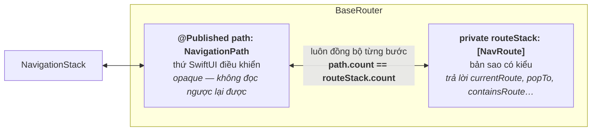
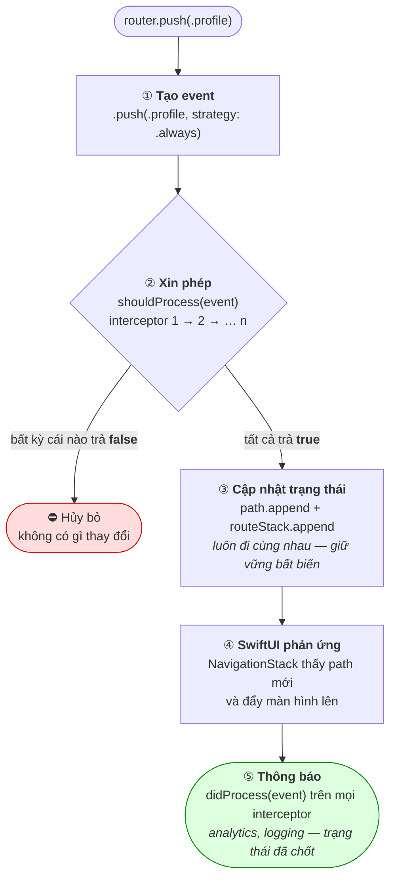
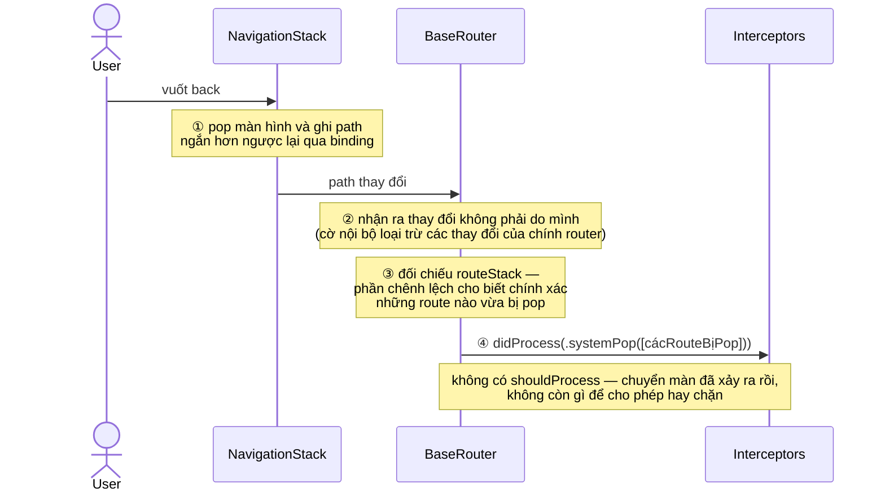

# 🧭 NaviStack

Hệ thống điều hướng type-safe cho SwiftUI, có khả năng can thiệp vào từng bước điều hướng. Quản lý stack tập trung, xử lý sheet/cover toàn cục, API hỗ trợ sẵn deep link, và chuỗi interceptor hai giai đoạn cho auth guard, analytics, khóa điều hướng.

🇬🇧 [Read in English](README.md)

## 📋 Mục lục

- [Tại sao dùng NaviStack?](#-tại-sao-dùng-navistack)
- [Tính năng](#-tính-năng)
- [Kiến trúc & Cách hoạt động](#-kiến-trúc--cách-hoạt-động)
- [Yêu cầu](#-yêu-cầu)
- [Cài đặt](#-cài-đặt)
- [Bắt đầu nhanh](#-bắt-đầu-nhanh)
- [Quy tắc vàng](#-quy-tắc-vàng)
- [API điều hướng](#-api-điều-hướng)
- [Sheet & Full-Screen Cover](#-sheet--full-screen-cover)
- [Interceptor](#-interceptor)
- [Tình huống thực tế](#-tình-huống-thực-tế)
- [Giới hạn & Lưu ý](#-giới-hạn--lưu-ý)
- [Bảng tra cứu Properties](#-bảng-tra-cứu-properties)
- [Testing](#-testing)
- [FAQ](#-faq)
- [License](#-license)

---

## 🎯 Tại sao dùng NaviStack?

Điều hướng SwiftUI theo cách truyền thống thường dẫn đến:

- Nhiều biến `@State` rải rác trên mỗi màn hình
- Logic điều hướng phân tán khắp các view
- Luồng màn hình khó viết test
- Không type-safe, không theo dõi được lịch sử điều hướng

**NaviStack** tập trung hóa điều hướng với:

- Một đối tượng duy nhất nắm toàn bộ trạng thái điều hướng của mỗi `NavigationStack`
- Route định nghĩa bằng enum, type-safe
- Xử lý sheet & fullScreenCover tích hợp sẵn
- Interceptor cho guard, analytics, khóa điều hướng
- Deep link gọn trong một bước (`setStack`) và khôi phục trạng thái

---

## ✨ Tính năng

- ✅ **Swift 6 native** — strict concurrency, router & interceptor đều `@MainActor`
- ✅ **Điều hướng type-safe** — route dạng enum
- ✅ **Push strategy** — `.always`, `.ifNotExists`, `.navigateOrPush`
- ✅ **Deep link trong một bước** — `setStack(_:)` thay toàn bộ stack chỉ với một hiệu ứng chuyển màn
- ✅ **`dismissAll()`** — đóng mọi modal và pop về root trong một lệnh
- ✅ **Nhận biết thao tác back của hệ thống** — vuốt back được báo cho interceptor qua `.systemPop`
- ✅ **Interceptor hai giai đoạn** — chặn trước khi xảy ra, quan sát sau khi hoàn tất; gỡ được bằng token
- ✅ **Khôi phục trạng thái** — `encodedStack()` / `restoreStack(from:)` khi route là `Codable`
- ✅ **Ghi log có cấu trúc** — `os.Logger` (subsystem `com.navistack`), lọc được trong Console.app

---

## 🏗 Kiến trúc & Cách hoạt động

Phần này giải thích từng thành phần của package, để bất kỳ developer nào cũng nắm được toàn bộ cách hoạt động chỉ trong một lần đọc.

### Tổng quan package

Package chỉ gồm **ba file source** và **năm kiểu public**:

```
NaviStack
├── BaseRouter.swift        →  BaseRouter            (bản thân router)
├── Interceptor.swift       →  protocol Interceptor, InterceptorToken
└── InterceptorEvent.swift  →  NavigationEvent, SheetEvent, CoverEvent (+ PushStrategy)
```

| Thành phần | Là gì | Nhiệm vụ |
|---|---|---|
| `BaseRouter<NavRoute, SheetRoute, CoverRoute>` | Class `@MainActor`, `ObservableObject` | Nắm toàn bộ trạng thái điều hướng. Cung cấp API điều hướng (`push`, `pop`, `setStack`, `presentSheet`, …). Cho mọi hành động chạy qua chuỗi interceptor. |
| `NavRoute` / `SheetRoute` / `CoverRoute` | Tham số generic | Các enum **của bạn** mô tả màn hình trong app: màn hình push, sheet, và full-screen cover. Dùng `Never` cho vị trí không cần. |
| `Interceptor` | Protocol `@MainActor` | Điểm mở rộng. Được hỏi ý kiến *trước* mỗi hành động (có thể chặn) và được thông báo *sau* khi hoàn tất (để chạy side effect). |
| `NavigationEvent` / `SheetEvent` / `CoverEvent` | Enum (`Equatable`) | Mô tả *điều gì đang diễn ra*: `.push(.profile, …)`, `.systemPop([…])`, `.present(.login)`, … Được truyền cho interceptor và dễ assert trong test. |
| `InterceptorToken` | Struct opaque | "Biên lai" mà `addInterceptor` trả về. Dùng để gỡ đúng interceptor đó sau này. |

### Mô hình trạng thái — tại sao router giữ *hai* nơi chứa stack

Bên trong, `BaseRouter` lưu navigation stack ở hai chỗ, và đây là quyết định thiết kế quan trọng nhất cần hiểu:



- **`path`** là `NavigationPath` của SwiftUI — thứ duy nhất `NavigationStack` hiểu được. Nó *chỉ ghi được, không đọc được*: bạn append và remove được, nhưng không bao giờ hỏi được "route ở vị trí số 2 là gì?"
- **`routeStack`** là mảng `[NavRoute]` thông thường mà router luôn giữ đồng bộ từng bước với `path`. Nó tồn tại *chính vì* `path` là opaque — không có nó thì `currentRoute`, `navigationDepth` và `popTo(_:)` không thể triển khai được.

Mọi thay đổi đều cập nhật **cả hai nơi cùng lúc**. Khi *hệ thống* thay đổi `path` (vuốt back), router lập tức đối chiếu và đồng bộ lại `routeStack` (xem luồng ② bên dưới). Đây cũng là lý do tồn tại của [Quy tắc vàng](#-quy-tắc-vàng): `NavigationLink(value:)` chỉ ghi vào `path`, và router không có cách nào biết *cái gì* vừa được push.

### Luồng ① — hành trình của một lệnh điều hướng (`push`, `pop`, `setStack`, …)



Năm bước này áp dụng cho mọi API điều hướng: `pop`, `popTo`, `popToRoot`, `replace`, `setStack`, `presentSheet`, `dismissSheet` và các hàm tương ứng cho cover. Chỉ khác nhau ở loại event.

### Luồng ② — hành trình của thao tác back hệ thống (vuốt back, nút back)

User có thể rời màn hình mà không bao giờ gọi router: vuốt cạnh trái, nút back trên navigation bar, hoặc menu back khi nhấn giữ. Router *quan sát* các thao tác này thay vì điều khiển chúng:



Đây là lý do interceptor analytics thấy được **mọi** lần thoát màn, kể cả bằng gesture — và cũng là lý do `.systemPop` không bao giờ chặn được.

### Luồng ③ — sheet & cover

Sheet có hai con đường để đóng, và chúng được thiết kế hành xử khác nhau có chủ đích:

| | Bằng code (`router.dismissSheet()`) | Bằng gesture (kéo xuống) |
|---|---|---|
| Interceptor chặn được không? | ✅ được, qua `shouldProcess` | ❌ không — sheet đã biến mất khỏi màn hình rồi |
| Event nhận được | `.dismiss(programmatic: true)` | `.dismiss(programmatic: false)`, chỉ qua `didProcess` |
| Cách ngăn chặn | trả `false` từ interceptor | `.interactiveDismissDisabled()` trên nội dung sheet |

Router cung cấp sẵn `sheetBinding` / `fullScreenCoverBinding` — các `Binding` dùng ngay cho `.sheet(item:)` / `.fullScreenCover(item:)`. Setter của binding chính là nơi router *phát hiện* việc đóng bằng gesture: SwiftUI ghi `nil` vào đó khi thao tác kéo hoàn tất.

### Nguyên tắc thiết kế

1. **Một đầu mối ra lệnh duy nhất.** Mọi điều hướng đi qua router; router là nơi duy nhất được ghi vào `path` (Quy tắc vàng).
2. **Không thể chặn quá khứ.** Những gì hệ thống đã thực hiện xong (`.systemPop`, đóng bằng gesture) chỉ được *báo cáo*, không bao giờ bị *hỏi ý kiến* — giả vờ chặn được sẽ làm trạng thái lệch khỏi những gì đang hiển thị.
3. **Thay đổi trọn vẹn trong một bước.** `setStack` thay cả stack trong một lần ghi — một hiệu ứng chuyển màn, một event, không có trạng thái dở dang.
4. **Báo lỗi to và rõ khi đang phát triển.** Nếu `path` dài ra sau lưng router, một log mức `fault` được ghi ngay lập tức, thay vì để `currentRoute` âm thầm sai dần.
5. **Đồng bộ hoàn toàn & dễ test.** Mọi lệnh API hoàn tất một cách đồng bộ; event là `Equatable`; không cần UI test cho logic điều hướng.

---

## 📦 Yêu cầu

- iOS 16.0+ / macOS 13.0+
- Swift 6.0 toolchain (Xcode 16+)

> Package compile ở Swift 6 language mode. App sử dụng có thể ở Swift 5 hoặc Swift 6 mode — protocol interceptor `@MainActor` hoạt động ở cả hai.

---

## 🚀 Cài đặt

### Swift Package Manager

```swift
dependencies: [
    .package(url: "https://github.com/konotori/NaviStack.git", from: "1.0.0")
]
```

### Cài đặt thủ công

Thêm các file source: `BaseRouter.swift`, `Interceptor.swift`, `InterceptorEvent.swift`.

---

## ⚡ Bắt đầu nhanh

### Bước 1: Định nghĩa Routes

```swift
import NaviStack

// Các màn hình dạng push — bắt buộc Hashable, chỉ cần Codable nếu muốn khôi phục trạng thái
enum AppRoute: Hashable, Codable {
    case home
    case profile(userId: String)
    case editProfile(userId: String)
    case settings
    case orders
    case orderDetail(id: String)
}

// Sheet — bắt buộc Identifiable.
// Với enum có associated values, `var id: Self { self }` + Hashable là cách đơn giản nhất.
enum AppSheet: Identifiable, Hashable {
    case userInfo(id: String)
    case createPost

    var id: Self { self }
}

// Full-screen cover
enum AppCover: Identifiable, Hashable {
    case login
    case onboarding

    var id: Self { self }
}
```

### Bước 2: Tạo Router

```swift
typealias AppBaseRouter = BaseRouter<AppRoute, AppSheet, AppCover>

final class AppRouter: AppBaseRouter {}
```

> Typealias `AppBaseRouter` giúp signature của interceptor ngắn gọn — bạn sẽ dùng nó rất nhiều.

### Bước 3: Kết nối `NavigationStack`

```swift
struct ContentView: View {
    @StateObject private var router = AppRouter()

    var body: some View {
        NavigationStack(path: $router.path) {
            HomeView()
                .navigationDestination(for: AppRoute.self) { route in
                    switch route {
                    case .home:
                        HomeView()
                    case .profile(let id):
                        ProfileView(userId: id)
                    case .editProfile(let id):
                        EditProfileView(userId: id)
                    case .settings:
                        SettingsView()
                    case .orders:
                        OrdersView()
                    case .orderDetail(let id):
                        OrderDetailView(orderId: id)
                    }
                }
        }
        .sheet(item: router.sheetBinding) { sheet in
            switch sheet {
            case .userInfo(let id):
                UserInfoView(userId: id)
            case .createPost:
                CreatePostView()
            }
        }
        .fullScreenCover(item: router.fullScreenCoverBinding) { cover in
            switch cover {
            case .login:
                LoginView()
            case .onboarding:
                OnboardingView()
            }
        }
        .environmentObject(router)
    }
}
```

> ⚠️ Lưu ý: truyền `router.sheetBinding` (không phải `$router.sheetBinding`) — nó vốn đã là một `Binding` rồi.

### Bước 4: Điều hướng!

```swift
struct HomeView: View {
    @EnvironmentObject var router: AppRouter

    var body: some View {
        VStack(spacing: 20) {
            Button("View Profile") {
                router.push(.profile(userId: "123"))
            }
            Button("Show User Info Sheet") {
                router.presentSheet(.userInfo(id: "456"))
            }
            Button("Back") {
                router.pop()
            }
            Button("Back to Root") {
                router.popToRoot()
            }
        }
        .navigationTitle("Home")
    }
}
```

---

## 📐 Quy tắc vàng

> **Mọi điều hướng phải đi qua router.**

**Không** dùng `NavigationLink(value:)`:

```swift
// ❌ SAI — đi vòng qua router
NavigationLink(value: AppRoute.settings) {
    Text("Settings")
}

// ✅ ĐÚNG — đi qua router
Button("Settings") {
    router.push(.settings)
}
```

**Lý do:** `NavigationPath` là kiểu opaque — router không thể đọc nội dung bên trong. Khi `NavigationLink(value:)` làm path dài ra sau lưng router, `currentRoute`, `navigationDepth` và `popTo` sẽ sai một cách âm thầm, và độ lệch này tồn tại cho đến khi quay về root. (Xem [mô hình trạng thái](#mô-hình-trạng-thái--tại-sao-router-giữ-hai-nơi-chứa-stack) để hiểu đầy đủ.)

Router phát hiện việc này lúc runtime và ghi một log mức **fault** (xem được trong Console.app dưới subsystem `com.navistack`):

```
NavigationPath grew outside the router (path: 3, tracked: 2).
Did you use NavigationLink(value:)? ...
```

Nếu thấy log này, hãy tìm và thay thế `NavigationLink(value:)` vi phạm.

*Việc xóa* route do hệ thống (vuốt back, nút back) được hỗ trợ đầy đủ — xem [Back hệ thống & `.systemPop`](#back-hệ-thống--systempop).

---

## 🧭 API điều hướng

### Push Strategy

```swift
// Luôn push (cho phép trùng lặp) — mặc định
router.push(.profile(userId: "123"))

// Chỉ push nếu route chưa có trong stack
router.push(.profile(userId: "123"), strategy: .ifNotExists)

// Nhảy về route nếu đã tồn tại, push nếu chưa
router.push(.profile(userId: "123"), strategy: .navigateOrPush)
```

| Strategy | Hành vi | Dùng khi |
|---|---|---|
| `.always` | Push vô điều kiện | Điều hướng thông thường |
| `.ifNotExists` | Bỏ qua khi route đã có trong stack | Tránh màn hình trùng lặp |
| `.navigateOrPush` | Pop về route đã có, hoặc push mới | Bấm lại tab, nút "đi đến X" |

### Các thao tác Pop

```swift
router.pop()              // lùi một màn
router.popTo(.orders)     // lùi về lần xuất hiện GẦN NHẤT của .orders
router.popToRoot()        // xóa sạch stack
```

> **Route trùng lặp:** khi cùng một route xuất hiện nhiều lần trong stack
> (ví dụ luồng `profile(A) → followers → profile(B) → … → profile(A)` trong app mạng xã hội),
> `popTo` và `.navigateOrPush` nhắm đến lần xuất hiện **gần nhất** (mới nhất) — màn user vừa thấy —
> chứ không phải cái cũ nhất.

### Replace & Set Stack

```swift
// Thay màn hình trên cùng (ví dụ: màn skeleton → nội dung đã tải xong)
router.replace(with: .orderDetail(id: "42"))

// Thay TOÀN BỘ stack trong một bước — một hiệu ứng chuyển màn, một event interceptor
router.setStack([.orders, .orderDetail(id: "42")])
```

`setStack(_:)` là công cụ chính để xử lý deep link. So với `popToRoot()` + N lần `push()`:

- SwiftUI chỉ thực hiện **một** hiệu ứng chuyển màn thay vì N+1 (không giật, không mất lệnh push)
- Interceptor thấy **một** event `.setStack(routes)` duy nhất — auth guard hoặc cho phép toàn bộ đích đến, hoặc chặn hết; không có stack dở dang

### Đóng tất cả

```swift
router.dismissAll()   // đóng cover → đóng sheet → popToRoot
```

Gọi lệnh này trước khi xử lý deep link — nếu một sheet đang mở khi push notification đến, màn hình đích sẽ bị dựng *phía sau* sheet.

---

## 📄 Sheet & Full-Screen Cover

```swift
router.presentSheet(.createPost)
router.dismissSheet()

router.presentFullScreenCover(.login)
router.dismissFullScreenCover()

// Trạng thái chỉ đọc
let sheet = router.presentedSheet            // AppSheet?
let cover = router.presentedFullScreenCover  // AppCover?
```

### Đóng bằng gesture (kéo xuống)

Khi user **kéo sheet xuống**, việc đóng *đã xảy ra rồi* tại thời điểm router quan sát được — không thể chặn. Router đồng bộ trạng thái và thông báo cho interceptor bằng `SheetEvent.dismiss(programmatic: false)`, chỉ qua `didProcess`.

**Muốn ngăn kéo-để-đóng, dùng cơ chế của SwiftUI** (tác động *trước khi* gesture xảy ra):

```swift
.sheet(item: router.sheetBinding) { sheet in
    CreatePostView()
        .interactiveDismissDisabled(hasUnsavedChanges)
}
```

Đóng bằng code (`router.dismissSheet()`) **có** đi qua `shouldProcess` và chặn được. Payload của event cho biết nguồn gốc: `.dismiss(programmatic: true/false)`.

### Một sheet tại một thời điểm

Router quản lý **một sheet và một cover toàn cục**. Present sheet mới khi sheet cũ đang mở sẽ *thay nội dung* chứ không xếp chồng. Với luồng sheet-trên-sheet, cho sheet một `NavigationStack` và router con riêng — xem [Tình huống 6](#6-luồng-phức-tạp-trong-sheet--router-con).

---

## 🎯 Interceptor

Interceptor là điểm mở rộng cho các nhu cầu xuyên suốt: auth guard, analytics, logging, feature flag, khóa điều hướng.

### Protocol

```swift
@MainActor
public protocol Interceptor<NavRoute, SheetRoute, CoverRoute> {
    associatedtype NavRoute: Hashable
    associatedtype SheetRoute: Identifiable
    associatedtype CoverRoute: Identifiable

    // Gọi TRƯỚC hành động — trả về false để chặn. (Chỉ với event chặn được.)
    func shouldProcess(_ event: NavigationEvent<NavRoute>, for router: BaseRouter<...>) -> Bool
    func shouldProcess(_ event: SheetEvent<SheetRoute>, for router: BaseRouter<...>) -> Bool
    func shouldProcess(_ event: CoverEvent<CoverRoute>, for router: BaseRouter<...>) -> Bool

    // Gọi SAU khi hành động thành công — side effect (analytics, logging).
    func didProcess(_ event: NavigationEvent<NavRoute>, for router: BaseRouter<...>)
    func didProcess(_ event: SheetEvent<SheetRoute>, for router: BaseRouter<...>)
    func didProcess(_ event: CoverEvent<CoverRoute>, for router: BaseRouter<...>)
}
```

Mọi method đều có sẵn implementation mặc định (cho phép / không làm gì) — chỉ cần implement đúng cái bạn cần.

> **`Interceptor` là protocol, không phải class.** Conform bằng typealias:
>
> ```swift
> final class MyInterceptor: Interceptor {
>     typealias NavRoute = AppRoute
>     typealias SheetRoute = AppSheet
>     typealias CoverRoute = AppCover
>     // ...
> }
> ```
>
> Protocol là `@MainActor` nên kiểu conform tự động được gắn vào MainActor, thoải mái đọc trạng thái router và kích hoạt điều hướng tiếp theo — kể cả từ app Swift 6 với strict concurrency.

### Bảng tra cứu Event

| Event | Chặn được? | Khi nào |
|---|---|---|
| `NavigationEvent.push(route, strategy:)` | ✅ | `push()` |
| `NavigationEvent.pop` / `.popTo(route)` / `.popToRoot` | ✅ | pop bằng code |
| `NavigationEvent.replace(route)` | ✅ | `replace(with:)` |
| `NavigationEvent.setStack([routes])` | ✅ | `setStack()`, `restoreStack(from:)` |
| `NavigationEvent.systemPop([routes])` | ❌ chỉ `didProcess` | vuốt back, nút back, menu back khi nhấn giữ |
| `SheetEvent.present(route)` | ✅ | `presentSheet()` |
| `SheetEvent.dismiss(programmatic: true)` | ✅ | `dismissSheet()` |
| `SheetEvent.dismiss(programmatic: false)` | ❌ chỉ `didProcess` | gesture kéo xuống |
| `CoverEvent.present(route)` / `.dismiss(...)` | như sheet | cover |

### Back hệ thống & `.systemPop`

Trên iOS, cách phổ biến nhất để rời một màn hình là **vuốt từ cạnh trái** — thao tác không bao giờ gọi `router.pop()`. Router quan sát các thay đổi path này và báo cáo dưới dạng `.systemPop([cácRouteBịPop])`:

- Chỉ đến `didProcess` — chuyển màn đã xảy ra rồi nên không thể chặn.
- Trạng thái router (`currentRoute`, `navigationDepth`) đã được cập nhật khi `didProcess` chạy — an toàn để đọc cho analytics.
- Mang theo **tất cả** route bị pop (menu back khi nhấn giữ có thể pop nhiều màn cùng lúc).

> Muốn một màn hình không thể bị back bằng gesture, dùng `.navigationBarBackButtonHidden(true)` trên màn đó — interceptor không thể chặn một gesture đã hoàn thành.

### Thêm & Gỡ Interceptor

```swift
let token = router.addInterceptor(AuthGuardInterceptor(session: session))

// Sau đó — gỡ đúng cái này, các cái khác vẫn chạy
router.removeInterceptor(token)

// Gỡ sạch tất cả (hiếm khi nên dùng trong production)
router.clearInterceptors()
```

Interceptor chạy **theo thứ tự đăng ký**. `shouldProcess` đầu tiên trả `false` sẽ chặn event; sau đó `didProcess` không được gọi trên bất kỳ interceptor nào.

```swift
// Thứ tự khuyến nghị:
router.addInterceptor(AuthGuardInterceptor(session: session))   // 1. guard trước
router.addInterceptor(FeatureFlagInterceptor(flags: flags))     // 2. rồi đến flag
router.addInterceptor(AnalyticsInterceptor(analytics: tracker)) // 3. observer sau cùng
```

---

## 🏭 Tình huống thực tế

Tất cả ví dụ dưới đây dùng định nghĩa `AppRoute` / `AppSheet` / `AppCover` / `AppBaseRouter` từ phần [Bắt đầu nhanh](#-bắt-đầu-nhanh).

### 1. Auth Guard — chặn màn hình cần đăng nhập

```swift
extension AppRoute {
    var requiresAuth: Bool {
        switch self {
        case .profile, .editProfile, .settings, .orders, .orderDetail:
            return true
        case .home:
            return false
        }
    }
}

final class AuthGuardInterceptor: Interceptor {
    typealias NavRoute = AppRoute
    typealias SheetRoute = AppSheet
    typealias CoverRoute = AppCover

    private let session: SessionStore

    init(session: SessionStore) {
        self.session = session
    }

    func shouldProcess(_ event: NavigationEvent<AppRoute>, for router: AppBaseRouter) -> Bool {
        // Guard cả push lẫn thao tác thay cả stack (deep link!)
        let targets: [AppRoute]
        switch event {
        case .push(let route, _):  targets = [route]
        case .setStack(let stack): targets = stack
        default:                   return true
        }

        guard targets.contains(where: \.requiresAuth), !session.isLoggedIn else {
            return true
        }

        router.presentFullScreenCover(.login)
        return false
    }
}
```

> Guard `.setStack` rất quan trọng: deep link và khôi phục trạng thái đều đi qua nó. Thiếu case này, một push notification có thể đưa user chưa đăng nhập đi thẳng vào `.orderDetail`.

### 2. Analytics — bao gồm cả thoát màn bằng gesture

```swift
final class AnalyticsInterceptor: Interceptor {
    typealias NavRoute = AppRoute
    typealias SheetRoute = AppSheet
    typealias CoverRoute = AppCover

    private let analytics: AnalyticsService

    init(analytics: AnalyticsService) {
        self.analytics = analytics
    }

    func didProcess(_ event: NavigationEvent<AppRoute>, for router: AppBaseRouter) {
        switch event {
        case .push(let route, _):
            analytics.screenView("\(route)", depth: router.navigationDepth)

        case .pop, .popTo, .popToRoot:
            analytics.event("screen_exit", screen: router.currentRouteName)

        case .systemPop(let popped):
            // Vuốt back / nút back / menu back khi nhấn giữ.
            // Trạng thái router đã được đồng bộ — currentRouteName là màn
            // user vừa đáp xuống.
            analytics.event("screen_exit_gesture", screen: router.currentRouteName)
            _ = popped // danh sách route bị pop, nếu cần theo dõi từng màn

        case .replace, .setStack:
            analytics.screenView(router.currentRouteName, depth: router.navigationDepth)
        }
    }

    func didProcess(_ event: SheetEvent<AppSheet>, for router: AppBaseRouter) {
        if case .present(let sheet) = event {
            analytics.screenView("sheet_\(sheet)", depth: router.navigationDepth)
        }
    }
}
```

> **Tại sao `.systemPop` quan trọng:** vuốt cạnh trái là cách đa số user rời màn hình. Thiếu nó, số liệu thoát màn/funnel sẽ đếm thiếu các lần thoát bằng gesture — thường là phần lớn.

### 3. Deep Link — push notification & universal link

```swift
extension AppRouter {
    /// myapp://profile/123/edit  →  [.profile(123), .editProfile(123)]
    /// myapp://orders/42         →  [.orders, .orderDetail(42)]
    /// myapp://settings          →  [.settings]
    func handle(deepLink url: URL) {
        guard let components = URLComponents(url: url, resolvingAgainstBaseURL: true),
              let host = components.host
        else {
            return
        }

        let params = components.path.split(separator: "/").map(String.init)

        // 1. Sheet/cover có thể đang che màn hình — đóng hết trước,
        //    nếu không màn đích sẽ bị dựng phía sau modal.
        dismissAll()

        // 2. Dựng toàn bộ stack trong MỘT lần chuyển màn.
        switch host {
        case "profile":
            guard let userId = params.first else { return }
            var stack: [AppRoute] = [.profile(userId: userId)]
            if params.contains("edit") {
                stack.append(.editProfile(userId: userId))
            }
            setStack(stack)

        case "orders":
            if let orderId = params.first {
                setStack([.orders, .orderDetail(id: orderId)])
            } else {
                setStack([.orders])
            }

        case "settings":
            setStack([.settings])

        default:
            break
        }
    }
}
```

Kết nối:

```swift
// Universal link / custom scheme
.onOpenURL { url in
    router.handle(deepLink: url)
}
```

```swift
// User bấm push notification (UNUserNotificationCenterDelegate)
func userNotificationCenter(
    _ center: UNUserNotificationCenter,
    didReceive response: UNNotificationResponse
) async {
    if let orderId = response.notification.request.content.userInfo["orderId"] as? String {
        await MainActor.run {
            router.dismissAll()
            router.setStack([.orders, .orderDetail(id: orderId)])
        }
    }
}
```

> **Tại sao dùng `setStack` thay vì `popToRoot()` + nhiều lệnh push?** Thay đổi `path` nhiều lần liên tiếp trong một runloop rất dễ lỗi với `NavigationStack` (hiệu ứng chuyển màn chồng nhau, mất lệnh push trên iOS 16). Và auth guard của bạn thấy một event `.setStack` duy nhất thay vì N event mà nó chỉ chặn được một nửa.

### 4. Khôi phục trạng thái — sống sót khi app bị hệ thống tắt

iOS tắt app dưới nền khi thiếu RAM. Không có khôi phục, user rời app ở `Home → Orders → OrderDetail` sẽ quay lại và thấy `Home`. Yêu cầu `AppRoute: Codable`.

```swift
struct ContentView: View {
    @StateObject private var router = AppRouter()
    @Environment(\.scenePhase) private var scenePhase
    @SceneStorage("navStack") private var navData: Data?

    var body: some View {
        NavigationStack(path: $router.path) {
            HomeView()
                .navigationDestination(for: AppRoute.self) { route in
                    destination(for: route)
                }
        }
        .environmentObject(router)
        .task {
            // Khôi phục một lần lúc khởi động
            if let navData {
                try? router.restoreStack(from: navData)
            }
        }
        .onChange(of: scenePhase) { phase in
            // Lưu khi app vào nền
            if phase == .background {
                navData = try? router.encodedStack()
            }
        }
    }
}
```

> Khôi phục đi qua `setStack` — nghĩa là **interceptor của bạn có chạy**. Đây là tính năng có chủ đích: auth guard sẽ chặn đúng việc khôi phục vào màn hình được bảo vệ khi phiên đăng nhập đã hết hạn.

### 5. Bản nháp chưa lưu — chặn kéo-để-đóng đúng cách

Sheet soạn bài viết không được phép bị kéo xuống làm mất nội dung. Interceptor **không thể** chặn gesture (nó đã xảy ra rồi) — dùng `interactiveDismissDisabled`:

```swift
struct CreatePostView: View {
    @EnvironmentObject var router: AppRouter
    @State private var draftText = ""
    @State private var showDiscardAlert = false

    private var hasDraft: Bool {
        !draftText.isEmpty
    }

    var body: some View {
        NavigationStack {
            TextEditor(text: $draftText)
                .navigationTitle("New Post")
                .toolbar {
                    ToolbarItem(placement: .cancellationAction) {
                        Button("Cancel") {
                            if hasDraft {
                                showDiscardAlert = true
                            } else {
                                router.dismissSheet()
                            }
                        }
                    }
                }
        }
        // Chặn GESTURE kéo khi đang có bản nháp — cách duy nhất đáng tin cậy
        .interactiveDismissDisabled(hasDraft)
        .alert("Discard draft?", isPresented: $showDiscardAlert) {
            Button("Discard", role: .destructive) {
                router.dismissSheet()
            }
            Button("Keep Editing", role: .cancel) {}
        }
    }
}
```

Nếu muốn theo dõi analytics các bản nháp bị bỏ, quan sát `SheetEvent.dismiss` trong `didProcess` — cờ `programmatic` cho biết là nút Cancel hay gesture.

### 6. Luồng phức tạp trong Sheet — router con

Sheet toàn cục chỉ có một tầng theo thiết kế. Khi sheet cần điều hướng nhiều bước riêng (ví dụ luồng thanh toán), cho nó một **router con**:

```swift
enum CheckoutRoute: Hashable {
    case shipping
    case payment
    case review
}

struct CheckoutSheet: View {
    // Router con sống và chết cùng sheet
    @StateObject private var checkoutRouter = BaseRouter<CheckoutRoute, Never, Never>()
    @EnvironmentObject var appRouter: AppRouter

    var body: some View {
        NavigationStack(path: $checkoutRouter.path) {
            CartView()
                .navigationDestination(for: CheckoutRoute.self) { route in
                    switch route {
                    case .shipping: ShippingView()
                    case .payment:  PaymentView()
                    case .review:   ReviewView()
                    }
                }
        }
        .environmentObject(checkoutRouter)
    }
}
```

`BaseRouter<CheckoutRoute, Never, Never>` — dùng `Never` cho các vị trí modal không cần.

### 7. Khóa thanh toán — đóng băng điều hướng khi đang xử lý nghiệp vụ quan trọng

Khi API thanh toán đang chạy (3–5 giây), user không được rời màn hình:

```swift
final class NavigationLockInterceptor: Interceptor {
    typealias NavRoute = AppRoute
    typealias SheetRoute = AppSheet
    typealias CoverRoute = AppCover

    func shouldProcess(_ event: NavigationEvent<AppRoute>, for router: AppBaseRouter) -> Bool {
        false // chặn mọi điều hướng bằng code khi đang được cài
    }

    func shouldProcess(_ event: SheetEvent<AppSheet>, for router: AppBaseRouter) -> Bool {
        false
    }
}

@MainActor
final class PaymentViewModel: ObservableObject {
    private let router: AppRouter
    private let payments: PaymentService

    init(router: AppRouter, payments: PaymentService) {
        self.router = router
        self.payments = payments
    }

    func submitPayment() async {
        // Cài khóa — theo token, nên các interceptor khác vẫn chạy bình thường
        let lock = router.addInterceptor(NavigationLockInterceptor())

        let result = await payments.charge()

        // Gỡ khóa TRƯỚC KHI điều hướng đến màn kết quả
        router.removeInterceptor(lock)

        switch result {
        case .success(let orderId):
            router.replace(with: .orderDetail(id: orderId))
        case .failure:
            router.pop()
        }
    }
}
```

> ⚠️ Interceptor chỉ chặn được điều hướng **bằng code**. Kết hợp khóa với `.navigationBarBackButtonHidden(true)` trên màn thanh toán để vô hiệu hóa cả nút back hệ thống lẫn vuốt cạnh.

### 8. Đăng xuất — đặt lại mọi thứ từ view model

```swift
@MainActor
final class SessionViewModel: ObservableObject {
    private let router: AppRouter
    private let session: SessionStore

    init(router: AppRouter, session: SessionStore) {
        self.router = router
        self.session = session
    }

    func logout() async {
        await session.signOut()
        router.dismissAll()                       // dọn sạch modal + stack
        router.presentFullScreenCover(.login)     // cover vốn không cho phép back
    }
}
```

> Login/onboarding nên đặt trong `fullScreenCover`, không nằm trên navigation stack — cover không có nút back và không vuốt back được, chính xác là hành vi bạn cần.

### 9. Feature Flag — kiểm soát màn hình thử nghiệm

```swift
final class FeatureFlagInterceptor: Interceptor {
    typealias NavRoute = AppRoute
    typealias SheetRoute = AppSheet
    typealias CoverRoute = AppCover

    private let flags: FeatureFlagService

    init(flags: FeatureFlagService) {
        self.flags = flags
    }

    func shouldProcess(_ event: SheetEvent<AppSheet>, for router: AppBaseRouter) -> Bool {
        guard case .present(.createPost) = event else {
            return true
        }

        guard flags.isEnabled(.composer) else {
            router.presentSheet(.userInfo(id: "coming-soon"))
            return false
        }
        return true
    }
}
```

### 10. UI nhận biết trạng thái điều hướng — nút back & breadcrumb

```swift
struct NavigationToolbar: View {
    @EnvironmentObject var router: AppRouter

    var body: some View {
        HStack {
            if router.canPop {
                Button {
                    router.pop()
                } label: {
                    Label("Back", systemImage: "chevron.left")
                }
            }

            Spacer()

            Text(router.currentRouteName)
                .font(.headline)

            Spacer()

            Text("Level \(router.navigationDepth)")
                .font(.caption)
                .foregroundColor(.secondary)
        }
        .padding()
    }
}
```

### 11. App nhiều Tab — mỗi tab một router

Mỗi tab sở hữu một stack độc lập. Modal thuộc về toàn app (cover đăng nhập) đặt trên một router cấp app riêng.

```swift
struct MainTabView: View {
    @StateObject private var homeRouter = BaseRouter<HomeRoute, Never, Never>()
    @StateObject private var searchRouter = BaseRouter<SearchRoute, Never, Never>()

    var body: some View {
        TabView {
            NavigationStack(path: $homeRouter.path) {
                HomeFeedView()
                    .navigationDestination(for: HomeRoute.self) { route in
                        switch route {
                        case .detail(let id): DetailView(id: id)
                        case .comments(let postId): CommentsView(postId: postId)
                        }
                    }
            }
            .environmentObject(homeRouter)
            .tabItem { Label("Home", systemImage: "house") }

            NavigationStack(path: $searchRouter.path) {
                SearchView()
                    .navigationDestination(for: SearchRoute.self) { route in
                        switch route {
                        case .results(let query): SearchResultsView(query: query)
                        }
                    }
            }
            .environmentObject(searchRouter)
            .tabItem { Label("Search", systemImage: "magnifyingglass") }
        }
    }
}
```

Bấm lại tab để quay về màn đầu của tab — implement bằng `homeRouter.popToRoot()` trong handler chọn tab.

---

## ⚠️ Giới hạn & Lưu ý

Những hành vi của iOS mà **không thư viện điều hướng nào kiểm soát hết được** — cần nắm rõ trước khi đưa app lên store:

| Tình huống | Điều gì xảy ra | Nên làm gì |
|---|---|---|
| Vuốt back / nút back | Interceptor không chặn được (đã xảy ra rồi). Được báo qua `.systemPop` đến `didProcess`. | Muốn ngăn: `.navigationBarBackButtonHidden(true)` trên màn đó |
| Kéo sheet xuống để đóng | Interceptor không chặn được. Được báo qua `.dismiss(programmatic: false)` đến `didProcess`. | Muốn ngăn: `.interactiveDismissDisabled(condition)` |
| `NavigationLink(value:)` | Đi vòng qua router → lệch trạng thái. Được phát hiện và ghi log mức fault (subsystem `com.navistack`). | Luôn điều hướng qua `router.push(...)` |
| Sheet trên sheet | Present mới sẽ thay nội dung sheet hiện tại. | Router con bên trong sheet ([Tình huống 6](#6-luồng-phức-tạp-trong-sheet--router-con)) |
| Thay đổi `path` nhiều lần trong một runloop | Dễ lỗi với SwiftUI (đặc biệt iOS 16). | Dùng `setStack(_:)` — chỉ một lần thay đổi |

---

## 🔑 Bảng tra cứu Properties

| Property | Kiểu | Mô tả |
|---|---|---|
| `path` | `NavigationPath` | Bind vào `NavigationStack(path:)` |
| `currentRoute` | `NavRoute?` | Đỉnh stack (`nil` khi ở root) |
| `currentRouteName` | `String` | `String(describing:)` của route hiện tại, `"Root"` khi ở root |
| `navigationDepth` | `Int` | Độ sâu stack (0 = root) |
| `canPop` | `Bool` | Có thể lùi lại hay không |
| `routesFromRoot` | `[NavRoute]` | Stack hiện tại, từ root → đỉnh |
| `routesToRoot` | `[NavRoute]` | Stack hiện tại, từ đỉnh → root |
| `presentedSheet` | `SheetRoute?` | Sheet đang hiển thị |
| `presentedFullScreenCover` | `CoverRoute?` | Cover đang hiển thị |
| `sheetBinding` | `Binding<SheetRoute?>` | Truyền vào `.sheet(item:)` |
| `fullScreenCoverBinding` | `Binding<CoverRoute?>` | Truyền vào `.fullScreenCover(item:)` |

---

## 🧪 Testing

Router viết unit test được hoàn toàn — không cần UI test cho logic điều hướng. Event là `Equatable` nên mỗi assertion chỉ một dòng.

```swift
import Testing
@testable import YourApp

@MainActor
struct NavigationTests {

    @Test
    func deepLink_buildsOrderStack() {
        let router = AppRouter()

        router.handle(deepLink: URL(string: "myapp://orders/42")!)

        #expect(router.routesFromRoot == [.orders, .orderDetail(id: "42")])
    }

    @Test
    func authGuard_blocksProtectedRoute_whenSignedOut() {
        let router = AppRouter()
        let session = SessionStore(loggedIn: false)
        router.addInterceptor(AuthGuardInterceptor(session: session))

        router.push(.settings)

        #expect(router.navigationDepth == 0)                       // bị chặn
        #expect(router.presentedFullScreenCover == .login)         // bị chuyển hướng
    }

    @Test
    func backSwipe_reportsSystemPop() {
        let router = AppRouter()
        let spy = SpyInterceptor()      // ghi lại các event didProcess
        router.addInterceptor(spy)

        router.push(.orders)
        router.push(.orderDetail(id: "42"))
        router.path.removeLast()        // mô phỏng vuốt back

        #expect(spy.navigationEvents.last == .systemPop([.orderDetail(id: "42")]))
        #expect(router.currentRoute == .orders)
    }
}
```

Spy dùng lại được:

```swift
final class SpyInterceptor: Interceptor {
    typealias NavRoute = AppRoute
    typealias SheetRoute = AppSheet
    typealias CoverRoute = AppCover

    private(set) var navigationEvents: [NavigationEvent<AppRoute>] = []
    private(set) var sheetEvents: [SheetEvent<AppSheet>] = []

    func didProcess(_ event: NavigationEvent<AppRoute>, for router: AppBaseRouter) {
        navigationEvents.append(event)
    }

    func didProcess(_ event: SheetEvent<AppSheet>, for router: AppBaseRouter) {
        sheetEvents.append(event)
    }
}
```

---

## ❓ FAQ

**Q: Dùng được nhiều router không?**
A: Được — mỗi `NavigationStack` một router. App nhiều tab dùng mỗi tab một cái ([Tình huống 11](#11-app-nhiều-tab--mỗi-tab-một-router)); sheet có luồng riêng dùng router con ([Tình huống 6](#6-luồng-phức-tạp-trong-sheet--router-con)).

**Q: Tại sao interceptor không thấy vuốt back trong `shouldProcess`?**
A: Một gesture đã hoàn thành thì không thể "xin phép" được nữa. Vuốt back đến qua `didProcess` dưới dạng `.systemPop`. Muốn ngăn, dùng `.navigationBarBackButtonHidden(true)`.

**Q: Làm sao để sheet không bị vuốt mất?**
A: `.interactiveDismissDisabled(condition)` — không phải interceptor. Xem [Tình huống 5](#5-bản-nháp-chưa-lưu--chặn-kéo-để-đóng-đúng-cách).

**Q: Điều hướng từ view model được không?**
A: Được — inject router vào ([Tình huống 8](#8-đăng-xuất--đặt-lại-mọi-thứ-từ-view-model)). Router là `@MainActor`, hãy gọi từ ngữ cảnh `@MainActor`.

**Q: Điều hướng sau khi xử lý async?**
A:

```swift
Task {
    await viewModel.save()
    router.push(.orderDetail(id: "42"))   // Task thừa kế @MainActor từ view
}
```

**Q: Tại sao `currentRoute` bị sai?**
A: Gần như chắc chắn có `NavigationLink(value:)` ở đâu đó. Kiểm tra Console.app với log fault subsystem `com.navistack`. Xem [Quy tắc vàng](#-quy-tắc-vàng).

**Q: Router có hỗ trợ `NavigationSplitView` không?**
A: Hiện chưa — nó nhắm vào `NavigationStack`. Layout nhiều cột vẫn dùng được một router cho stack của mỗi cột.

---

## 📄 Lời cảm ơn

Thư viện này lấy cảm hứng và được refactor từ [NavigationRouter](https://github.com/duongcuong4395/MyPackage/blob/main/Sources/NavigationRouter) gốc của Duong Cuong. Package bổ sung hệ thống interceptor, nhận biết back hệ thống, deep link trong một bước, khôi phục trạng thái và hỗ trợ Swift 6.

## 📄 License

MIT License
